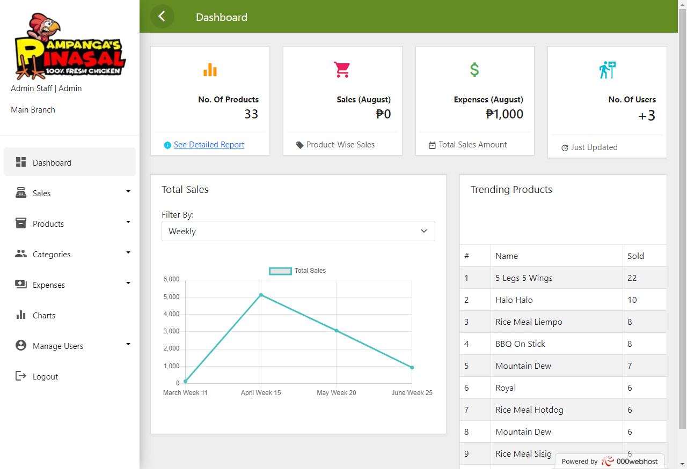

# Full-Stack Point-of-Sale System for Small Businesses.

Point of Sale System was very crucial for many small businesses. This enables business owners, managers, accountants, and cashiers to add new sales while also monitoring all storage and transactions within the system.

> This was a full-stack web application system that was built with HTML, CSS, JavaScript, Bootstrap, PHP, and MySQL. 
> 
> This system was also built with Font Awesome, ChartJS, and DataTables.

This was a requirement for completing the Capstone project of a group of students from Lucena City. 

> TEST Account that you can use:
> 
> Username: accountant  
> Password: accountant
>
>
> [Note: All of the data in this system was just a dummy data.]

**Live Demo**: [VISIT HERE!](https://pampangasinasalpos.000webhostapp.com/)

**Source Code**: [CLICK HERE!](https://github.com/rovicbalingbing/point-of-sale-system.git)

**Screenshot:**

